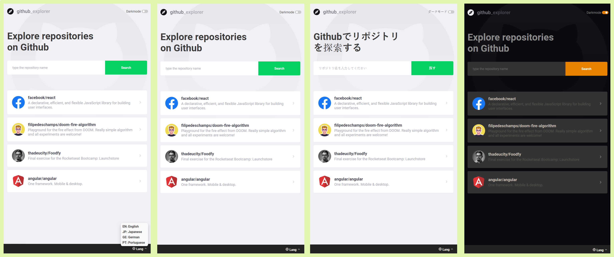
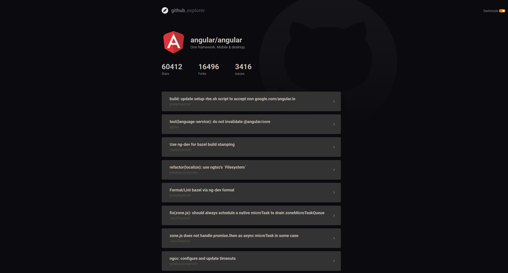

<h3 align="center">
  Github Explorer
</h3>

<p align="center">
  

  <a href="https://github.com/thadeucity">
    
  </a>

  

</p>

<p align="center">
  <a href="#rocket-about-the-project">About the Project</a>&nbsp;&nbsp;&nbsp;|&nbsp;&nbsp;&nbsp;
  <a href="#memo-license">License</a>
</p>

## :rocket: About the Project

Github Explorer is a React-JS app that uses the Github API to search and list repositories. The user can save a repository in the list searching by ```Creator/Repository_name```. And the user is able to find more about the repository by clicking the respective card.

This project was part of the GoStack Bootcamp by Rocktseat, but besides meeting all the requirements I developed a darkmode theme and a switch to turn it on and off, and I also added a language selector.

### Technologies
This project was developed with:

- [React-JS](https://reactjs.org/)
- [Typescript](https://www.typescriptlang.org/)

### DashBoard



### Details




## :memo: License

This project is under the MIT license. See the [LICENSE](LICENSE.md) for details.

---

Made with ♥ by Victor Alvarenga :wave: [Get in touch!](https://www.linkedin.com/in/victoralvarenga/)
